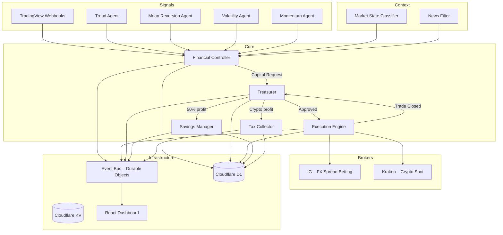

# 🤖 Trading-Pod

> Fully automated, low-risk, multi-agent trading system with independent signal agents, deterministic Financial Controller, capital-gated Treasurer, and real-time dashboard.
> UK-compliant: FX via IG spread betting (tax-free) + Crypto via Kraken spot (CGT applies).

---

## Architecture



## Profit Flow

```
Trade closes with profit
  ├── FX spread bet → TAX-FREE
  │     └── Profit → Treasurer (50%) + Savings (50%)
  └── Crypto spot → CGT applies
        ├── Tax Collector reserves ~24% (after £3,000 annual exempt)
        └── Remaining → Treasurer (50%) + Savings (50%)
```

## Tech Stack

| Layer | Technology |
|-------|-----------|
| **Language** | TypeScript 5.5+ (strict) |
| **Monorepo** | pnpm workspaces |
| **Backend** | Cloudflare Workers (5 workers) |
| **Database** | Cloudflare D1 (SQLite) |
| **Config Store** | Cloudflare KV |
| **Real-time** | Cloudflare Durable Objects (WebSocket) |
| **Dashboard** | React 18 + Vite 5 + TailwindCSS + Recharts + Zustand |
| **Hosting** | Cloudflare Pages |
| **FX Broker** | IG (REST API, spread betting, FCA-regulated) |
| **Crypto Broker** | Kraken (REST API, spot only) |
| **Signal Source** | TradingView webhooks |
| **Validation** | Zod runtime schemas |
| **Testing** | Vitest (119 unit tests) |
| **CI** | GitHub Actions (typecheck + audit + tests) |

## Repository Structure

```
trading-pod/
├── packages/
│   ├── shared/          # Types, schemas, utils (shared across all packages)
│   ├── agents/          # 4 signal agents + credibility manager
│   ├── core/            # FC, Treasurer, Savings, Tax, Execution, Risk Rules
│   ├── backend/
│   │   ├── fc-worker/           # Financial Controller worker
│   │   ├── treasurer-worker/    # Treasurer worker
│   │   ├── savings-worker/      # Savings Manager worker
│   │   ├── webhook-worker/      # TradingView webhook ingestion
│   │   ├── event-stream-worker/ # Durable Object WebSocket server
│   │   ├── d1-schema.sql        # D1 database schema
│   │   └── kv-schema.json       # KV key patterns
│   └── dashboard/       # React SPA (Cloudflare Pages)
├── scripts/             # Migration & upgrade scripts
├── docs/                # Architecture & setup documentation
├── .github/workflows/   # CI pipeline
├── .env.example         # Environment variable template
├── vitest.config.ts     # Test configuration
├── tsconfig.base.json   # Shared TypeScript config
├── pnpm-workspace.yaml  # Monorepo workspace definition
└── package.json         # Root scripts & dev dependencies
```

## Signal Agents

| Agent | Strategy | Holding Time |
|-------|----------|-------------|
| **Trend** | MA crossover + ATR-based SL/TP | 240 min |
| **Mean Reversion** | Z-score / Bollinger Bands | 120 min |
| **Volatility** | ATR compression → expansion | 180 min |
| **Momentum** | Multi-period ROC + acceleration | 360 min |

Context providers (not signal agents, no credibility scores):
- **Market State Classifier** — ATR-based regime detection (calm/normal/volatile)
- **News Filter** — blocks trading during high-impact events

## Credibility Scoring

Agents earn credibility via EMA:

$$S_{new} = \alpha \cdot R + (1 - \alpha) \cdot S_{old}$$

- $\alpha = 0.1$ (smoothing factor)
- $R = 1$ for correct (profitable) signals, $R = 0$ for incorrect
- Idle decay: $\lambda = 0.997$ per day
- Initial score: 0.5, minimum floor: 0.05
- FC uses credibility-weighted consensus for direction decisions

## Safety Model

1. **Independent agents** — no agent can place a trade alone
2. **Financial Controller** — deterministic risk checks gate every decision
3. **Treasurer** — daily capital ceiling (10% of base), scale factor starts at 1%
4. **Savings Manager** — one-way vault, funds never return to the trading pool
5. **Tax Collector** — reserves 24% of crypto gains for HMRC CGT
6. **Risk Rules** — min R:R 1.5, max SL 3%, max 5 trades/day, blocked regimes
7. **Loss Circuit Breaker** — auto-pauses trading after 3 consecutive losses or 5% daily drawdown
8. **Paper Trading Mode** — `TRADING_MODE=paper` (default) forces all orders through MockBrokerAdapter

## UK Tax Compliance

- **FX spread bets** → tax-free (classified as gambling by HMRC)
- **Crypto spot** → Capital Gains Tax at 24% (higher rate)
- **£3,000 annual exempt amount** (2025/26 onwards)
- Tax Collector reserves approximate CGT as cash-flow buffer
- Actual year-end calculation: use Koinly or similar (same-day + 30-day matching rules)
- UK tax year: 6 April – 5 April

## Quick Start

```bash
# Clone
git clone https://github.com/JoelBondoux/Trading-Pod.git
cd Trading-Pod

# Install dependencies
pnpm install

# Build all packages
pnpm -r build

# Typecheck
pnpm -r typecheck

# Run tests (119 unit tests)
pnpm test

# Start dashboard dev server
pnpm --filter @trading-pod/dashboard dev

# Apply D1 schema (local)
node scripts/migrate-d1.mjs --local

# Deploy a worker (e.g., fc-worker)
cd packages/backend/fc-worker
npx wrangler deploy
```

> **Paper mode is ON by default.** Set `TRADING_MODE=live` in `wrangler.jsonc` when ready for real trading.
> Copy `.env.example` to `.env` for local development variables.

## Monthly Cost

| Service | Cost |
|---------|------|
| TradingView Essential | ~$13/mo |
| Cloudflare Workers/D1/KV/Pages | Free tier |
| IG | Free (spread-only) |
| Kraken | Free (commission on trades) |
| GitHub | Free |
| **Total** | **~$13/mo** |

## License

MIT
